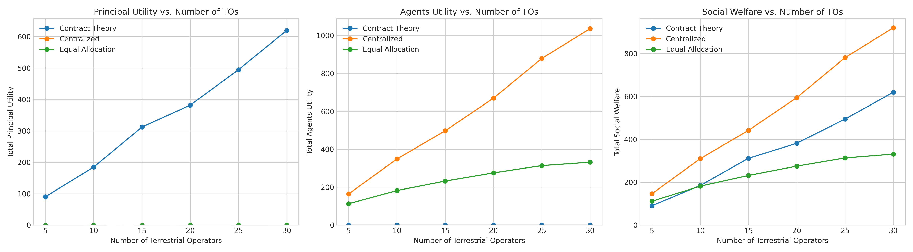

# Game Theory-Based Resource Allocation in Satellite Communications

This project models and simulates resource allocation in a satellite communication system using a game-theoretic approach, specifically the principal-agent model. It compares the performance of a sophisticated contract-based mechanism against two baseline scenarios.

## Introduction

In many modern communication systems, a central entity (the "Principal," e.g., a satellite operator) needs to allocate a scarce resource (e.g., bandwidth) to multiple agents (the "Agents," e.g., terrestrial network operators). The challenge is that the agents have private information about their "type" (e.g., how efficiently they can use the resource), creating a situation of information asymmetry.

This simulation explores how the Principal can design optimal allocation mechanisms to maximize their utility while ensuring the agents are incentivized to participate and reveal their types truthfully.

## Scenarios

The simulation compares three different resource allocation scenarios:

### 1. Contract Theory

This is the core scenario of the project. The Principal, not knowing the agents' true types, designs a "menu of contracts." Each contract is a pair of (resource allocation, payment). The menu is designed to be:
- **Individually Rational (IR):** Each agent gets a non-negative utility from at least one contract.
- **Incentive Compatible (IC):** Each agent is incentivized to choose the contract designed for its type, thus truthfully revealing its private information.

The simulation uses optimization techniques (`scipy.optimize.minimize`) to find the optimal contract menu that maximizes the Principal's expected utility.

### 2. Centralized Optimal (Social Planner)

This is a theoretical benchmark that assumes a "social planner" who has perfect information about all agents' types. The planner allocates resources to maximize the total social welfare (the sum of the Principal's and all agents' utilities). This scenario represents the upper bound of system performance.

### 3. Equal Allocation

This is a naive baseline scenario where the Principal divides the total available resource equally among all participating agents.

## How to Run

1.  **Clone the repository:**
    ```bash
    git clone https://github.com/vinh-vo/gametheory-resource-allocation.git
    cd gametheory-resource-allocation
    ```

2.  **Install dependencies:**
    It is recommended to use a virtual environment.
    ```bash
    python -m venv venv
    source venv/bin/activate  # On Windows, use `venv\Scripts\activate`
    pip install -r requirements.txt
    ```

3.  **Run the simulation:**
    ```bash
    python main.py
    ```
    The script will run the simulation for a range of agent numbers, print the results to the console, save the detailed results to `results/simulation_results.csv`, and generate a comparative plot at `results/performance_comparison.png`.

## Results

The simulation shows that the **Contract Theory** approach significantly outperforms the naive **Equal Allocation** and closely tracks the performance of the theoretical **Centralized Optimal** benchmark, demonstrating its effectiveness in handling information asymmetry.

The following plot is generated by the simulation, comparing the social welfare achieved under each scenario as the number of agents increases:



## Configuration

The main simulation parameters can be adjusted in the `config.py` file. This includes:
- Agent types, their efficiency parameters (`theta`), and their distribution (`prob`).
- The Principal's cost function for providing the resource.
- Total available satellite resources.
